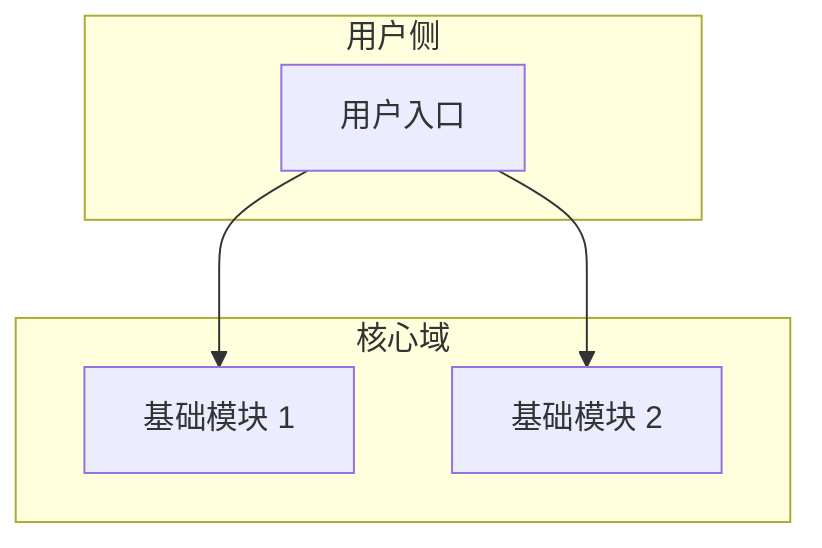

# {{PROJECT_NAME}} 产品架构总图

## 产品定位

<!-- 一句话定位 + 核心场景 + 目标用户。**这一段由人写**，反映产品本身的稳定信息，不随机器维护刷新而变化。 -->

## 总体架构图

<!-- 推荐使用 mermaid。架构图反映基础模块之间的关系，不展开到子模块。 -->

## 基础模块速览

<!-- WORKFRAME:AUTO-INDEX:START -->
> ⚙️ 此段由 `module-index-refresh` 自动维护，请勿手动编辑。

| 基础模块 | 状态 | 摘要 |
|---|---|---|
| _（暂无基础模块。运行 `/core:module-init` 创建第一个）_ | - | - |

<!-- WORKFRAME:AUTO-INDEX:END -->

## 修订记录

- {{TODAY}} 项目初始化

## 参考

- skill: `document-norms` §3（三段制 overview 规范）
- `reference/module-architecture.md` §3（modules/ 树结构）
- 各基础模块 overview：见上方机器维护索引段
