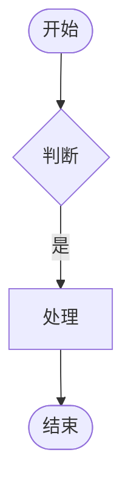

# {{REQ_TITLE}} — PRD

<!-- 由 `prd-writer` skill 生成；正式启动写作时调用 `/prd-writer` 触发完整工作流（六段骨架：理解→骨架确认→填充→落盘→附属产物→发布，工序形态按项目 PRD 框架）。本骨架仅占位，章节结构与各章写法见项目 `.claude/skills/prd-style/SKILL.md`（PRD 框架），通用写作纪律（否定句裁剪 / 精简表达 / 段落组织·分点分段 / 变更融入三步）见 prd-writer `writing-guide.md`。 -->

## 一、需求背景与目标

**背景**：

<!-- 现状困境，回答"为什么要做"；不描述方案。 -->

**目标**：

-

**边界**：

<!-- 仅放全局性真边界（不写出来开发会做错的）；无则删除本小节。 -->

-

## 二、方案概览

<!-- 分点总结本次要做的核心内容，3-6 点，每点一两句，一目了然。 -->

1. **{核心内容 1}**：{一两句概括}
2. **{核心内容 2}**：{一两句概括}

## 三、需求路径（V1；无 UI 界面的需求删除本章）

<!-- 平台枚举与命名见项目 `.claude/skills/prd-style/SKILL.md` §6 本项目补充口径。 -->

- {平台/系统} > {一级菜单} > {页面/弹窗} > {本次动作}
- 权限控制：{需要（配置项与开放范围）/ 不需要（一句说明）}

## 四、业务流程与逻辑

<!-- 本需求全部流程图（主流程 + 关键分支）集中本章；改流程 = 改对应 Mermaid 源码 → 重渲 PNG。 -->

### 主流程

**流程图**：

**Mermaid 源码**（留档 / AI 可读，与上图同步维护）：

### 核心后端逻辑（产品视角，按需）

<!-- 数据一致性口径 / 复用哪条线上链路 / 并发与时序约束；并在上方流程图对应节点标注。 -->

## 五、需求详情

<!-- V1 主导时本章可题为「前端交互详情」；按前端模块分级，同一功能不跨同层级铺开。 -->

### {模块 1}

| 元素 | 说明 | 初始状态 | 交互逻辑 |
|---|---|---|---|
|  |  |  |  |

<!-- 有状态机时追加「控件 × 状态矩阵」；视觉细节由 `prototypes/` HTML 原型承载，不画 ASCII 示意图。 -->

## 六、验收标准

<!-- 格式遵循 `acceptance-criteria` skill；AC 编号全文唯一递增。 -->

| 编号 | 验收标准 | 对应模块 |
|---|---|---|
| AC-01 |  |  |

## 七、待确认项（按需；无用户提出的未决事项时删除本章）

<!-- 仅收录用户明确提出的未决事项；模型自身疑问应在写作中当场向用户确认清楚，不归档进表。确认后结论融入正文 + 变更记录留痕，本表删行。 -->

| # | 事项 | 影响 | 责任方 | 状态 |
|---|---|---|---|---|
| 1 |  |  |  | 待确认 |

## 八、变更与决策记录

| 日期 | 版本 | 背景 | 内容 |
|---|---|---|---|
| {{TODAY}} | v1.0 | 初版 | prd-writer 生成 |

<!-- 每版本一行；纯拍板不改正文的决策也进表，版本列写「—」。 -->

## 关联资产

- HTML 原型：`./prototypes/index.html`
- 测试用例：`./test-cases/`
- 实现状态：`../../../current-state/`
- 跨子需求总览：`../overview.md`
