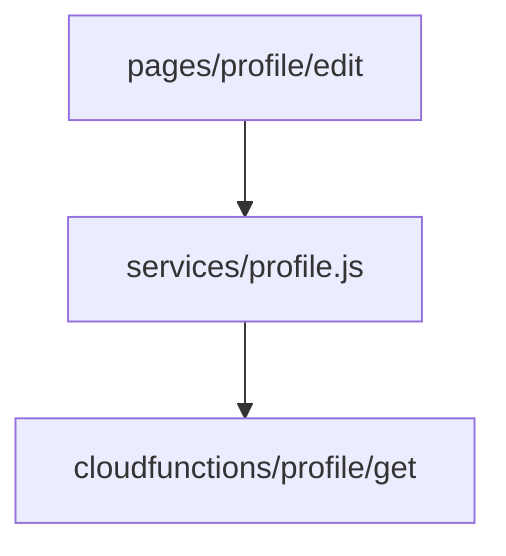

# {{SUB_NAME}} 代码索引

<!-- 子模块涉及的所有代码文件及其角色。`code_paths` 的人类可读版。 -->

## 文件清单（按子目录分组）

### 页面 / 入口

| 文件 | 角色 | 关键导出 / 入口 |
|---|---|---|
| _（如 miniprogram/pages/profile/edit/index.js）_ | 页面入口 | onLoad / data |

### 组件

| 文件 | 角色 | props / 事件 |
|---|---|---|
| _（如 miniprogram/components/avatar-cropper/index.js）_ | UI 组件 | - |

### 服务 / 工具

| 文件 | 角色 | 导出 |
|---|---|---|
| _（如 miniprogram/services/profile.js）_ | 业务服务 | - |

### 云函数 / 后端

| 文件 | 角色 | 触发 / 路由 |
|---|---|---|
| _（如 cloudfunctions/profile/get/index.js）_ | 云函数 | HTTP / 事件 |

### 配置 / 静态资源

| 文件 | 角色 |
|---|---|
| _（json / 图片 / 文档等）_ | - |

## 文件关系图

## 修订记录

- {{TODAY}} 初次解析（code-to-doc 生成）
